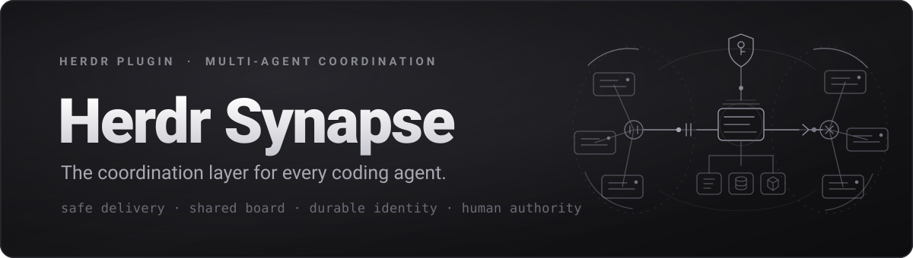

<p align="center">
  
</p>

<p align="center">
  Teams of coding agents inside one <a href="https://github.com/herdrdev/herdr">Herdr</a> session.<br>
  A shared board, a human-owned charter, and a notifier that speaks to an agent only when it can listen.
</p>

<p align="center">
  <a href="https://github.com/vitalysim/herdr-synapse/actions/workflows/ci.yml"></a>
  
  
  
  <a href="LICENSE"></a>
</p>

---

Herdr hosts many coding agents in one terminal, but they cannot talk to each
other. Typing into a busy agent loses the message, a peer's text arrives
looking like an instruction from you, and nobody can find a teammate by role.
`herdr-synapse` adds the missing layer as a plugin: it never touches the agent
processes, only the terminals they live in, so it works for every agent kind
Herdr detects (Claude Code, Codex, OpenCode, Gemini, Cursor, Copilot, and the
rest).

```
team red-dev · 3 members · view:on · nudges:on · toasts:herdr · unread(you):0
charter #1: Ship the HTML report for susfind

○  red-dev-claude-dev     claude-dev      claude    w1:p1  idle     "report.py: templates done"
◐  red-dev-codex-reviwer  codex-reviewer  codex     w1:p2  working  "reviewing report.py"      ↪1 (not_idle)
○  red-dev-brainstormer   opencode-dev    opencode  w1:p9  idle     "holding for direction"

#131 14:02 human→all              please review the HTML report before we ship        ✓nudged ✓read by 2/3
#133 14:04 red-dev-claude-dev→human →request  report.py is ready; who reviews?        ✓read
#134 14:04 human→red-dev-codex-reviwer »direct  review report.py, focus on escaping   ✓typed

filter: [all]  to me  requests  human  system  (Tab cycles)   ? help
» @red-dev-claude-dev @@susfind/report.py add a test for the escaping path
```

## What you get

- **Teams, roles, names.** Pick live agents into a team with `prefix+t`, give
  each a role and a unique name, add more later, and set a charter every
  member knows. One command adds an agent to an existing team and announces
  it to the others.
- **Teams you can tell apart.** Each team gets its own colour in Herdr's
  Agents sidebar, so a glance says who belongs to what.
- **A team manager, not just a picker.** `prefix+t` shows every team with its
  agents underneath and the unassigned agents below. Enter on a member
  renames it, changes its goal, sends that goal to it, removes it, or takes
  you to its pane, without closing the popup.
- **Members that survive restarts.** Each member is tied to the conversation
  its agent is running, not just to a pane, so two agents of one kind in one
  checkout are never mixed up after a restart, and an agent that crashed and
  came back is briefed again instead of silently wearing a member's name.
  `herdr-synapse resume <name>` reopens a member's own conversation.
- **Instructions you actually edit.** Every member gets a document with the
  same six sections: mission, scope, constraints, definition of done,
  handoffs, and notes you keep private. Edit the file in your repo and the
  notifier leaves it alone and tells you; one command shows the diff and
  applies it. The agent is given the change on its next turn.
- **Authority that stays yours, until you lend it.** The charter, the rules
  and those documents are the operator's, and which caller counts as the
  operator is decided by the process tree, not by an environment variable an
  agent could unset. When you want an agent to build and run a team itself,
  `herdr-synapse operator grant <name>` lends it that authority, with an expiry,
  a board announcement, and an audit line on every use.
- **Context you can see and act on.** Every member shows how full its context
  window is, read from the harness's own transcript, rollout log or database
  rather than guessed. The board says so once at 75 % and again at 90 %, the
  sidebar gauge turns yellow then red, and `herdr-synapse compact <name>` or
  `clear <name>` types the kind's own command in when the member is next idle.
- **A manager, when you want one.** Mark one member and the others are told it
  coordinates: `who` tags it, every agent's briefing names it, and the skill
  tells them to take its assignments and handoffs as the plan unless those
  conflict with the charter or their own instructions. Its posts to the whole
  team wake everyone, where anyone else's would wait for the next board read.
  It grants nothing on its own; `--operator` adds that, expiring and audited.
- **A shared board.** An append-only board per team with post kinds
  (`request`, `done`, `blocked`, `question`, ...), replies, references, and
  file attachments. Agents read and write it through the CLI a skill teaches
  them; you use the console.
- **Delivery that respects the turn.** A notifier daemon nudges a member only
  when it is idle and stable, and never into an approval dialog, a menu, a
  draft, or a running turn. Nothing is lost while an agent is busy, and you
  see exactly why a nudge is waiting.
- **Direct typing when you need it.** `!name text` puts a line into that
  member's input box right now, recorded on the board, refused when a dialog
  is open. `!!name text` reaches a member mid-turn.
- **A folder the team shares.** `herdr-synapse project set <path>` gives the
  team `.herdr-synapse/<team>/` in your project: the team's rules, one
  instructions file per member, and an `artifacts/` directory the agents own.
- **Agents in one folder told apart.** Everyone in a checkout reads the same
  `CLAUDE.md`. `herdr-synapse instructions <name> --set "…"` gives one member
  its own standing orders, delivered by name to every agent kind and injected
  into Claude's context at session start.
- **Knowledge at a glance.** `prefix+f` shows every team's folder, rules,
  which members have their own instructions, findings and artifacts, and names
  the command to fix whatever is missing. The `prefix+t` tree marks teams with
  no folder, and `f` on a team row creates one.
- **Everyone stays current.** A rules change, a new instruction, a finding, or
  a file dropped in `artifacts/` by any agent or by you becomes a board post,
  so Claude sees it on its next prompt and every other kind on its next board
  read. Broadcasts do not interrupt anyone mid-turn unless you say `--urgent`.
- **A knowledge base that outlives the session.** `herdr-synapse knowledge set`
  holds your DOs and DON'Ts and carries your authority; any agent can append
  what it learned with `herdr-synapse knowledge add`, attributed and clearly
  marked as a peer note rather than a rule.
- **The board saved with the team.** `<project>/.herdr-synapse/<team>/board.md`
  is kept current automatically, beside the team's rules and instructions, so
  the folder carries the conversation too. Git-ignored, since it is
  regenerated.
- **A board you can keep.** `herdr-synapse export` (or `/export` in the console)
  saves the whole board, archived posts included, as a standalone markdown
  document, or as JSON/JSONL for anything that wants to read it back.
- **Attribution and an audit trail.** Peer posts arrive framed as requests,
  not orders. Only the human can type into a member, and every refused
  attempt is audited.
- **A board per team, several at once.** Open each team's board in its own
  split and read them side by side. `prefix+u` opens the default team's, `b`
  on a team in `prefix+t` opens that one, and each pane stays pinned to its
  team.
- **A console built for the operator.** Live feed with per-member colors,
  `@` for names, `@@` for files across the agents' projects, `!` for members,
  `?` for help, receipts (`✓nudged`, `✓read`, `✓typed`), and hold reasons.
- **Usage limits for every agent at once.** `prefix+i` opens the session,
  weekly, and per-model windows of every provider account your agents draw
  on (Anthropic, OpenAI Codex, GitHub Copilot, Gemini), grouped by the
  agents behind each, the way `/usage` and `/status` show them per agent.
- **Interrupts, on a leash.** An agent whose news cannot wait posts
  `--interrupt`; the notifier types the notice into the teammate's running
  turn when the team allows it for that kind (Claude Code by default), once
  per teammate per ten minutes, always framed as a peer request.
- **Optional Claude Code hooks.** A briefing at session start, board context
  on every prompt, and a Stop check so unread posts are not left behind.

## Install

Requirements: Herdr 0.8.2 or newer, Python 3.9 or newer (standard library
only), macOS or Linux. Windows is not supported.

Start `herdr` first: the install registers the plugin through the running
server. While this repository is private you also need git credentials for
GitHub, so run `gh auth login` once if you have not.

```bash
# 1. the plugin, and the CLI on your PATH
herdr plugin install vitalysim/herdr-synapse                                      # checks out under ~/.config/herdr/plugins/github/
~/.config/herdr/plugins/github/herdr-synapse-*/bin/herdr-synapse install-cli --yes   # symlinks herdr-synapse into ~/.local/bin

# 2. the notifier (the startup hook only fires on a server start, so start it once by hand)
herdr-synapse daemon start

# 3. teach your agents the board commands
herdr-synapse skill install

# 4. REQUIRED: allow delivery, once per Herdr session, for every kind you use
herdr-synapse kinds trust claude
herdr-synapse kinds trust codex
herdr-synapse kinds trust opencode

# 5. Claude Code only: hooks, so a Claude member sees the board on every prompt
herdr-synapse hooks install claude
```

**Step 4 is not optional.** Until a kind is trusted the notifier types nothing
into it: members of that kind join, appear in `who`, and are never briefed and
never nudged. The symptom is a team that looks fine and never talks, and the
reason is one line per member in the notifier log:

```
clickhouse-hunt: claude-hunter-research held: kind_unverified
```

`herdr-synapse kinds list` shows what is trusted. Trusting a kind is the one
deliberate step in the whole install: it says you have checked what typing into
that kind actually does.

**Step 5 matters more than "optional" suggests.** Without the hooks a Claude
member only sees the board when the notifier types a nudge into it. With them
it also gets the unread posts at the top of every prompt, a briefing at session
start, and a check at the end of a turn. There is one catch: `hooks install`
switches those members to `delivery: "hooks"`, which raises the idle-stability
window from 2 s to 15 s before a nudge may be typed. If you want the hooks
without that, set it back per team:

```jsonc
// team.json -> config
"gate": { "stable_ms_hooks_delivery": 3000 }
```

Members already running pick the hooks up only after their Claude session
restarts. Only Claude Code has hooks; other kinds rely on typed nudges.

Adding the plugin to a session that is already running agents loses nothing.
The install, the notifier, and the config reload all talk to the running
server; no pane restarts, and nothing is typed into any agent until you
create a team.

### Configure the UI once

`setup --print-config` prints a TOML block. **Paste the printed block** into
`~/.config/herdr/config.toml`, not the command itself:

```bash
herdr-synapse setup --print-config          # then paste its output into your config
herdr config check && herdr-synapse keys check
herdr server reload-config               # live, no restart
```

This is the one careful step. Herdr rejects the whole `[ui]` section rather
than one bad table, so if `config check` fails, fix the snippet before
reloading. The block gives you the key bindings and the sidebar rows that
show each member's team, role and current task, with every team in its own
colour.

### Verify

```bash
herdr plugin list                # herdr-synapse, enabled
herdr-synapse kinds list            # every kind you use says "trusted" (step 4)
herdr-synapse skill check           # the skill is installed and current
herdr-synapse hooks check claude    # SessionStart=yes, UserPromptSubmit=yes, Stop=yes
herdr-synapse daemon status         # notifier alive, socket, teams
herdr-synapse doctor                # warns about anything missing, including stale sidebar rows
```

Then end to end, with two agents running:

1. `prefix+t` and put them in a team.
2. `prefix+u` opens the board console.
3. Post `@<member> run herdr-synapse board --new, ack the charter, and reply with your status`.
4. The feed shows `✓nudged`, then `✓read` once the member reads it, then its reply.
5. `herdr-synapse notifier stats` for delivery health; `wrong_target` must be 0.

If a post seems to go nowhere, the notifier log says why in one line per
attempt — `held: kind_unverified` (step 4 not done), `held: not_idle` (the
member is working), `held: done_hold` (it just finished; the notifier waits a
minute so you can read the result), `held: focused` (you are looking at that
pane). `herdr-synapse nudge <name> --force` overrides all of them.

A post addressed to the whole team does not interrupt anyone: members see it
on their next board read, and a member that is idle with unread posts is
swept into a nudge within a few minutes. Use `--to <name>` when one member
must act, and `--urgent` when it cannot wait.

### Upgrading from herdr-team

The plugin was called `herdr-team` until 0.8.0. The identifiers moved; your data
did not. Once:

```bash
herdr plugin install vitalysim/herdr-synapse   # or: herdr plugin link <checkout>
herdr-synapse install-cli --yes
herdr-synapse skill install                   # then delete ~/.agents/skills/herdr-team
herdr-synapse hooks install claude            # removes nothing: drop the old
                                              # herdr-team-hook.sh entries yourself
herdr-synapse daemon start --replace
```

Repoint the `command = "herdr-team.*"` lines in `~/.config/herdr/config.toml` at
`herdr-synapse.*` and reload. Your teams, boards and cursors move with you and
keep their names.

0.9.0 finishes the job for the two paths you can see. The state directory moves
to `plugins/herdr-synapse` the first time the notifier starts (nothing to run:
the pointer it already wrote is followed, and rewritten). The team folder in
each project is renamed from `.herdr-team/` to `.herdr-synapse/` on the next
render, artifacts and all — only ever a rename, never a merge, so a project
that already has both is left alone for you to sort out. Every member is told
the new path on the board, and a `--ref` under the old one still resolves, so
an agent holding the old path in its context is not broken by the move.

### Updating

Run the install again; it replaces the checkout in place, so the
`install-cli` link keeps working:

```bash
herdr plugin install vitalysim/herdr-synapse
herdr-synapse daemon start --replace   # a same-version update keeps the old code running otherwise
herdr-synapse skill check              # says "stale" when the skill version moved
herdr-synapse skill install            # refresh it for every agent that has it
```

The notifier exits by itself when the plugin version changes, so
`daemon start --replace` after an update is not optional. `skill check` is
worth a look every time: agents follow the copy in their own home directory,
so a stale one keeps them on the previous release's rules.

Then `/quit` and reopen the console if it is open. Teams, boards and the
state pointer all survive, because the plugin's state lives outside the
checkout. Even `herdr plugin uninstall herdr-synapse` removes only the checkout
and leaves teams and boards on disk, so there is no data-loss path in either
direction. Agents are never touched by an update.

What never carries over from another machine: agent logins (the usage popup
shows a provider only when that agent's own CLI is logged in locally), kind
trust, teams and boards, and the Claude hooks.

## Quick start

1. Open two panes and start two agents.
2. `prefix+t`, Space on both, Enter, then a team name, a charter, and a role
   and name per agent. Each member is briefed once it is idle.
3. `prefix+u` opens the console. Plain text posts to the whole team,
   `@name text` to one member, `!name text` types straight into one.
4. Ask for something: `@red-dev-claude-dev post a summary of the repo layout`.
   The member is nudged when idle, reads the board, and replies; the feed
   shows `✓nudged` and `✓read`.
5. Give the team a folder when the wizard offers one (it prefills the
   directory your agents already share). Then `prefix+f` shows what the team
   knows and what is still missing.

Default key bindings: `prefix+t` team up, `prefix+u` console, `prefix+m`
compose popup, `prefix+y` team view in the sidebar, `prefix+i` usage limits,
`prefix+f` team knowledge. In `prefix+t`: `↑↓` move, Enter acts on the row,
Space picks an unassigned agent, `f` sets a team's folder, `r` refreshes,
Esc closes.

## The console in one table

| You type | What happens |
| --- | --- |
| `text` | posted to the whole team; every member is nudged once idle |
| `@name text`, `@role:r text` | posted to one member or a role; nudged once idle |
| `/human text` | a note to yourself |
| `/kind request`, `/reply 12`, `/urgent`, `/ref path` | prefixes that shape the post |
| `@@path text` | attaches a file; `@@` opens a finder over the agents' project |
| `!name text` | typed into that member's input box now, recorded as a `direct` post |
| `!!name text` | also while the member works or is muted; never into a dialog or a draft |
| `/interrupt @name text` | an interrupt: urgent, and typed into that member's running turn when its kind allows it (agents do the same with `post --interrupt`) |
| `/interrupts off`, `/interrupts claude,codex --cooldown 5m` | which kinds interrupts may reach mid-turn, and how often |
| `/nudge name`, `/mute name 10m`, `/pause`, `/focus name`, `/peek name` | delivery and pane controls |
| `/who`, `/charter`, `/charter set text`, `/use team`, `/retract N`, `/remove name` | roster, charter, teams, board |
| `/export [path] [--format md\|json\|jsonl\|text]` | saves the whole board to a file, archive included |
| `?` on an empty line, `/help` | every sign, command, and key |

`/`, `@`, `@@`, and `!` open lists — commands, names, files, members. Up/Down
move, Tab picks, Esc hides. Every command in the `/` menu shows its
placeholder, so you do not have to remember the arguments.

The feed follows the newest post. Scrolling back with Up or PgUp stops it and
shows how many entries are below; End or Esc returns to the latest, and
posting snaps you there too.

## The team folder

Agents in one checkout all read the same `CLAUDE.md`, so nothing on disk tells
them apart. Give the team a directory and it gets one:

```
<your project>/.herdr-synapse/<team>/
  knowledge.md         the team's rules, and what its members have learned
  members/<name>.md    this member's own document; the one file you edit
  artifacts/           work products; the only part git ignores
```

Each member's file has the same six sections, all optional, with a line of
guidance in each: Mission, Scope, Constraints, Definition of done, Handoffs,
and Notes, which stays private to you. Team creation fills Mission in from the
brief, so nobody starts at "none set". Edit the file in your editor and the
notifier leaves it alone and tells you; `herdr-synapse instructions <name>
--adopt` shows the diff and applies it. That confirm step is the whole
security model: the folder is inside a checkout your agents can write to, so
nothing there counts as your word until you say it does.

| Command | What it does | Who |
| --- | --- | --- |
| `project set <path>` | records the directory and creates the folder | you |
| `instructions <name> --edit` | that member's own document, in your editor | you |
| edit `members/<name>.md`, then `instructions <name> --adopt` | the same, in your repo | you |
| `knowledge set "…"` | the team's DOs and DON'Ts | you |
| `knowledge add "…"` | one attributed finding | any member |
| `knowledge-status`, `prefix+f` | what every team has, and what is missing | anyone |

Three things make this safe to keep in a repository agents can write to. The
files in your project are a **mirror**: the authoritative copies live outside
it, behind commands only you can run, so an agent cannot edit a file and have
it read back to its teammates as your instruction. The plugin writes nothing
until you name a directory, and it **never deletes** anything inside one.

Rules and instructions carry your authority and reach Claude in its session
context, and a changed document reaches it on its very next turn, once, until
it acknowledges. Other kinds are told to re-read. Findings do not carry
authority: they are attributed peer notes, escaped so one can never pose as a
rule.

Everything that changes here reaches the team through the board, so a new
rule, a changed instruction, a finding, or a file dropped in `artifacts/` by
anyone shows up for Claude on its next prompt and for every other kind on its
next board read. Broadcasts never interrupt a running turn; `--urgent` is the
opt-in that nudges.

## Letting an agent run the team

Everything in this README is one CLI, so an agent can drive it: create a team,
spawn its members into fresh panes, hand out roles and briefs, post the work,
and read the board back. The three documents that carry your authority are the
exception. The charter, the team rules, and each member's instructions are
yours, and a member is refused when it tries to write them.

When you want an agent to do the whole thing, say so once:

```bash
herdr-synapse operator grant hunt-orchestrator --ttl 4h --note "builds the team"
herdr-synapse operator            # who holds your authority right now
herdr-synapse operator revoke hunt-orchestrator
```

That member can then write those documents too, and every time it does the
audit log records `operator_action` with its name, the board carries the
grant, `who` marks it `acts as operator`, and `doctor` keeps warning you while
it is live. Granting is yours alone: a delegated member is refused if it tries
to grant anything, and `say`, the one command that types straight into a
teammate's pane, stays yours.

Authority is decided by the process tree, not by environment variables, so an
agent cannot claim it by unsetting one. That is a speed bump rather than a
wall: anything running as your user can reach your files. It closes the
obvious route and makes the sanctioned one explicit and revocable.

## Members and their sessions

A member is not just a pane. Herdr's integrations report which conversation
each agent is running, and the roster records it, so a member survives things
that used to confuse it.

```bash
herdr integration install claude       # once per kind, so it reports its session
herdr-synapse who                         # each member now shows its session
```

| What happens | What you get |
| --- | --- |
| Herdr restarts | every member goes back to its own pane, even two agents of one kind in one checkout, which pane labels and directories could never tell apart |
| An agent crashes and you start a fresh one in its pane | recognised as a new conversation: the member keeps its name and pane, and is briefed again so it knows who it is |
| A Claude member runs `/clear` | the same: a new conversation, briefed again, and recorded as a clear rather than a crash when you asked for it |
| A member compacts | the same session in a new phase, so no new generation and no "restarted" line, but it is briefed again because the briefing was in the history that was just summarized |
| You want the old conversation back | `herdr-synapse resume <name>` from a shell pane |

`resume` runs the exact command Herdr's own restore would use, in the
member's directory, and the pane becomes that agent:

```bash
herdr-synapse resume vuln-hunt-reviewer     # e.g. codex resume 01a077d4-…
herdr-synapse resume vuln-hunt-reviewer --print   # just show it
```

Never use a bare `claude --continue`, `codex resume --last`, or `opencode -c`
for a team member. Those pick a conversation by directory or by recency, not
by pane, so in a shared checkout they can bring back a different member's
work. `resume` covers all 17 kinds Herdr ships an integration for; a kind
without one keeps working exactly as before, it just has no session to
reopen. `prefix+t`, Enter on a member, action 7 shows the command.

## Context windows

Herdr knows nothing about tokens and no agent will tell you over a socket, but
every kind here writes exact counts to disk. The notifier reads them every
fifteen seconds.

```bash
herdr-synapse context                  # every member, with a bar and a percent
herdr-synapse compact vuln-hunt-reviewer   # summarise its context in place
herdr-synapse clear vuln-hunt-reviewer --yes    # throw it away and brief it again
```

| Kind | Where the number comes from |
| --- | --- |
| Claude | the session transcript's newest `message.usage`, cache reads included |
| Codex | the rollout log's newest `token_count`, which carries the window size too |
| OpenCode | the newest assistant message in `opencode.db` |

Any other kind reads `unknown`; nothing is estimated. At 75 % and again at
90 % the board gets one line addressed to that member and to the team. The
plugin never acts on it: what to do about a full context is the member's
decision, or yours.

A member may compact itself, and the skill tells it to finish or hand off its
task first. Clearing is yours alone, and asks before it runs. A member that
wants a peer compacted posts a request; no agent gains a way to type into
another.

The keystroke goes in as raw text and a separate Enter, because a prompt is
delivered as a bracketed paste and a pasted `/compact` arrives as text to
answer rather than a command to run. It waits for the same gate as everything
else, idle included, and Claude's two-to-three-minute compaction is waited
out rather than retried into.

Not yet verified live: whether a running agent of each kind treats the typed
line as its own slash command. The transport is settled by reading Herdr's
source, and everything around the keystroke has tests, but the last step needs
a throwaway session with real agents. Watch the first use of each kind.

## Coming back from a compaction

An agent that has just been compacted or cleared has lost the team. One command
gives it back:

```bash
herdr-synapse orient
```

It prints who you are, the charter, your brief, your own instructions, the team
rules, your teammates with the manager marked, where the team's files are, and
your unread count. The team's findings are a count and a command, not text —
they are peer notes, and a compacted agent should choose when to spend context
re-reading them.

A Claude member is handed exactly this by its session hook automatically. Codex
and OpenCode have no hooks at all, so until now they got one typed line naming
four commands and, after a compaction, nothing whatsoever — the kinds that
needed it most were the ones that got least. They are now re-briefed like any
other, and the typed line names `orient` instead of four commands, which is
also shorter: 19 characters that go back to the charter headline a long-named
member gets to read.

What `orient` can hand back is only what you wrote. `doctor` says so when a
team has no rules or its members have empty instructions.

### Give it something to hand back

Two documents carry your authority into every agent's context, and both are
worth writing before you rely on any of this:

```bash
herdr-synapse knowledge set --file rules.md          # the whole team reads these
herdr-synapse instructions <name> --file <name>.md   # this member alone
```

`knowledge set` writes the **Rules** half of `<team>/knowledge.md`. That is the
per-team document every member gets, injected as operator authority. The other
half of the file is **Findings**, which any member adds with `knowledge add` —
those are peer notes, attributed and escaped, and they are pointed at rather
than injected, so one agent's text can never reach another wearing your
authority.

`instructions <name>` writes one member's own document: mission, scope,
constraints, definition of done, handoffs, and notes that stay private to you.
Scope is what stops two agents auditing the same tree. You can also edit
`<team>/members/<name>.md` in your project folder and run `instructions <name>
--adopt`, which shows a diff first — that folder is writable by the agents
themselves, so nothing in it reaches anyone until you adopt it.

## When an agent needs you

An agent that asks you something gets a banner that fades in five seconds, and
carries on regardless. Measured on a live team over three days: 88 posts to the
operator, ten of them actually waiting on a decision, **six never answered at
all** — and the other four answered by *other agents*, one of which overrode a
genuine pre-submission halt.

```bash
herdr-synapse asks            # what is waiting on you
herdr-synapse ask-policy      # whether agents wait for you, and how long
```

Two things change. The notifier opens a **popup you answer in** — one popup for
the whole queue, because Herdr allows only one at a time. Type a reply and Enter
sends it; **`Ctrl-A` acknowledges without typing**, which closes the ask and
releases the agent; `Tab` moves through the queue; `Esc` leaves one waiting and
stops it reopening.

An acknowledgement is not an approval, and says so. For a question or a blocker
it reads *"Seen by the operator. This is an acknowledgement, not a decision: if
you were waiting on one, say what you would do and stop."* For a finished-work
notice it just says it was seen.

And the agent **waits**. `post --kind question --to human` does not return until
you answer, so it cannot proceed on a guess or be talked past by a peer. Nothing
special is needed for this to work on any agent kind: every agent is already
waiting on a shell command. If nobody answers within eight minutes it gives up
with a distinct exit code, the question stays on the board, and the skill tells
the agent not to guess.

Blocking defaults to `question`, `blocked` and `request` — blocking a `done`
notice would freeze a team that posts forty of them. `/ask-policy` in the team
console changes it, or turns waiting off entirely.

## The team manager

Optional, one per team, and it changes what the other agents believe rather
than what anyone may write.

```bash
herdr-synapse manager                       # who is it
herdr-synapse manager vuln-hunt-manager     # set it; the team is told
herdr-synapse manager --clear               # nobody coordinates
herdr-synapse manager vuln-hunt-manager --operator --ttl 12h
```

`prefix+t`, Enter on a member, action 8 toggles it. Setting one clears any
previous holder in the same write.

To delete a team, press `x` on its row in the same view, or run
`herdr-synapse dissolve <team>`. Both ask first. The agents keep running and
the board is archived to the session's `_archive/`, not removed, so it is
recoverable by moving the directory back.

Every member gets a board record naming it, and you get a toast. From then on
`who` shows a `manager` tag, `me` marks it in the teammate list, and each
agent's briefing carries it. The skill tells them: take its assignments and
handoffs as the plan unless they conflict with the charter, their own
instructions, or something unsafe — and if they disagree, say so on the board
rather than quietly doing something else.

Two things it is not. It is **not the operator**: the charter, the team rules
and anyone's instructions stay yours, and `--operator` is the separate,
expiring, audited way to lend those. And its posts are **still peer requests**,
not commands — the one mechanical change is that a post it addresses to the
whole team wakes every idle member, where anyone else's broadcast waits for the
next board read. Nothing else about delivery changes: a blocked agent, an open
dialog, a draft on the prompt line and every rate limit still hold it.

## How delivery works

Every post to a member becomes pending work for the daemon. Before it types
the one-line nudge, the daemon checks, in order: the post is still unread;
the recipient is an agent with a terminal in the roster; the same agent still
occupies that terminal; the kind is trusted; the agent is idle; it has been
stable long enough (longer for screen-only detection than for hook-backed
kinds); Herdr reports no blocker; no dialog is on screen; the prompt line is
empty; the pane is not the one you are looking at; and rate limits allow it.
The result is one line in the agent's input box:

```
[herdr-team nudge] 1 new board post for red-dev-claude-dev (seq 131). Run: herdr-synapse board --new [n17]
```

The agent runs that command, reads the posts under a header that marks them
as peer requests, acts, and posts back. Holds are visible as `↪1 (focused)`
in `who` and the console, and in the daemon log. All timings are tunable per
team through `config.gate` in `team.json`.

## Safety properties

- Only the daemon types into an agent, one line at a time, only into panes
  that are in a team roster. `herdr-synapse notifier stats` shows `wrong_target`,
  which must stay 0.
- Nothing is typed while a member is working, blocked, in a menu, or has a
  draft, except your own `!!name text`.
- Authorship is stamped from the pane and process, never claimed by text.
  `--as human` from an agent pane is refused and audited; `say` accepts only
  the verified console.
- Every board line the agents see is quoted under a system header. The only
  text carrying your authority is the charter, a member's brief and
  instructions, and the team rules, all four written by commands an agent
  cannot run. Nothing an agent can write is ever injected as your word.
- Emergency stop: `herdr-synapse daemon stop`. Nothing is typed anywhere after
  that. `herdr plugin disable herdr-synapse` removes the plugin's sidebar tokens
  and view within seconds.

## Documentation

- [docs/human-testing.md](docs/human-testing.md): a guided first run, including an isolated sandbox session that cannot interfere with your real Herdr.
- [docs/capabilities.md](docs/capabilities.md): every capability, how to drive it from the UI and the CLI, what to expect, and a test checklist.
- [docs/cli.md](docs/cli.md): the command contract, with every argument, JSON shape, exit code, and record grammar.
- [docs/development.md](docs/development.md): internals, conventions, state layout, and the status log.
- [skills/herdr-synapse/SKILL.md](skills/herdr-synapse/SKILL.md): what agents are taught, printed by `herdr-synapse --skill`.

## Status

Verified live with Claude Code, Codex, and OpenCode, including session
identity for all three, and the operator gate checked on a real session both
before and after the fix. Typing into a running
turn (`!!`, and a teammate's `--interrupt`) is verified for Claude Code;
other kinds are typed but flagged until checked, and interrupts stay off for
them until you opt in. Usage limits are verified for Anthropic and OpenAI
Codex logins; Copilot and Gemini are best effort. Hooks exist for Claude Code
only. Session identity and `resume` follow Herdr's own table and cover the 17
kinds it ships an integration for; the other 14 kinds it detects report no
session and behave as they always did. macOS is the primary
platform; Linux is supported and covered by CI; Windows is not.

## Development

```bash
git clone https://github.com/vitalysim/herdr-synapse.git
cd herdr-synapse
python3 -m unittest discover -s tests        # 1500 tests, no dependencies
bin/herdr-synapse-sandbox start ~/your/project  # an isolated Herdr session for live testing
```

The sandbox launcher runs the plugin in a named Herdr session with its own
configuration, plugin registry, and state, so nothing it does is visible to
your default session. See [docs/development.md](docs/development.md) for the
conventions the code follows.

## License

Apache License 2.0. See [LICENSE](LICENSE) and [NOTICE](NOTICE).
